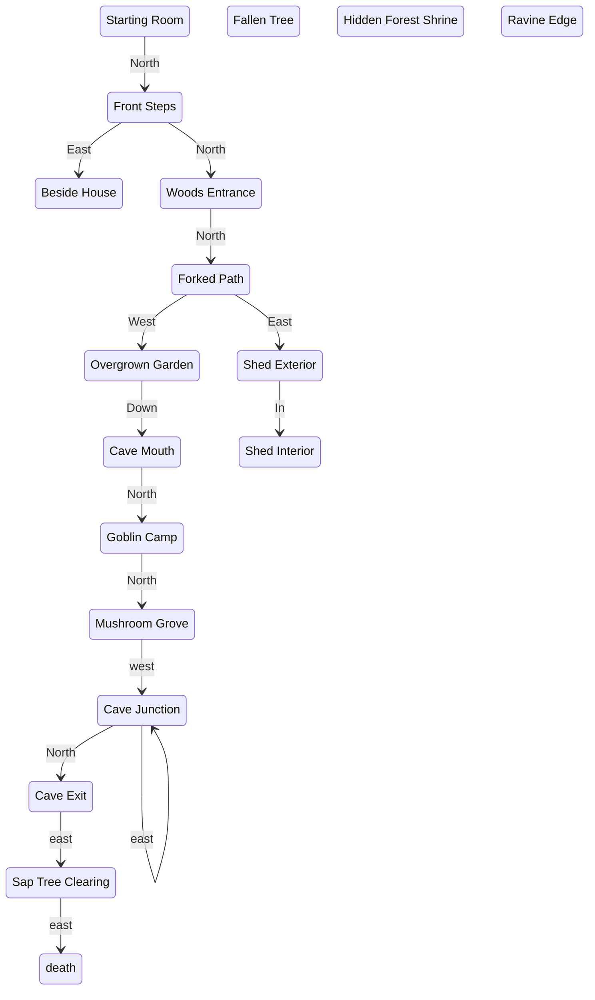

steps to play:
```text
look;
take key;
use key on door;
go north;
go east;
take screwdriver;
go west;
use screwdriver on lantern;
take lantern;
go north;
go north;
look;
go east;
use screwdriver on hinge;
go in;
take cloth;
go out;
go west;
go west;
use old sword on vines;
go down;
look;
go east;
go south;
take glowing mushroom;
go north;
use glowing mushroom on goblin;
take crystal shard;
go south;
look;
go south;
look;
go north;
talk to traveler;
talk to traveler;
talk to traveler;
talk to traveler;
talk to traveler;
go east;
go east;
go east;
go east;
```




add verbs:
- commands
- exit
- inventory
look after go successful
screwdriver+lantern
screwdriver description "works?"
- go east to enter shed
- describe the bowl in the shed;
the tools are so rusty they are useless, and fall apart in your hands.
go west to exit shed
- junction southern path description
- junction should say "no path to north"
overgrown garden description "vines" block the path;
tomb entrance description.
- goblin can't be scared off.
junction describe leaving cave system
wrap psql client
under construction location